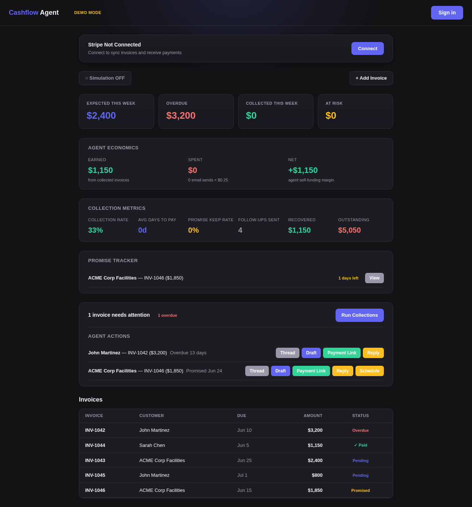
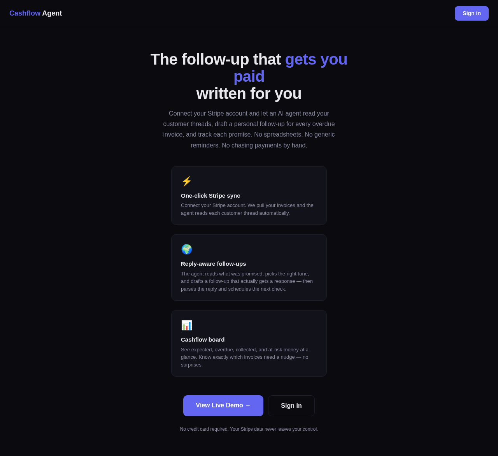

# Cashflow Agent 💰

> QuickBooks sends reminders. Cashflow Agent remembers the conversation.

An AI agent that reads your customer threads and writes the follow-up that actually gets you paid.

Built for the [Hermes Agent Accelerated Business Hackathon](https://x.com/NousResearch/status/2066921443548348436) — **Nous Research × NVIDIA × Stripe**

[](https://x.com/NousResearch/status/2066921443548348436)
[](https://x.com/GetAskClaw/status/2068908108114760150)

---

## The Problem

Small business owners waste hours chasing payments. QuickBooks fires off the same generic reminder to everyone. Customers ignore them.

But a follow-up that says *"Hey John, you said you'd pay Friday — I still haven't seen it"* actually gets a response. The problem is nobody has time to write those by hand.

We analyzed **15,000+ small business pain signals** across Reddit, X, and forums. Getting paid is the **#1 pain** with the **fewest solutions** — the market is saturated with lead-gen tools, but barely anyone does collections. That's the gap.

## The Agent Loop

```
Invoice becomes overdue
  → Agent reads the full conversation history
  → Picks the right tone (polite → firm → final)
  → Drafts a personal follow-up — you approve
  → Customer replies (real email or simulation mode)
  → Agent parses: promised / disputed / question / ignored
  → Updates invoice status, tracks the promise
  → Schedules a re-check for the day after the promise
  → Still unpaid? Escalates the tone, drafts again
  → Stripe payment confirmed → done
```

That loop — read context, draft, approve, parse reply, escalate — is what makes this an **agent**, not a mail merge.

## Earn. Spend. Run.

The hackathon asks for agents that earn, spend, and run real operations. Cashflow Agent does all three:

| | How |
|---|---|
| **Earn** | Collects overdue revenue — every paid invoice is money the agent recovered |
| **Spend** | Pays $0.25 per email send — recorded as a transaction, visible on the dashboard |
| **Run** | The collections loop runs autonomously — draft, approve, parse, track, escalate, repeat |

The dashboard shows **Earned / Spent / Net** in real time. The agent is self-funding.

## Built on Hermes

| Layer | What it does |
|---|---|
| **Hermes Agent Skill** | 5 Python scripts: read thread, draft follow-up, parse reply, create payment link, schedule follow-up |
| **Hermes CLI** | Scripts call `hermes chat -q` for LLM reasoning (tone selection, reply parsing, customer simulation) |
| **Hermes Cron** | Scheduled re-checks fire automatically — "Check if invoice was paid by the promised date" |
| **Next.js Dashboard** | The user interface — cashflow board, agent actions, thread drawer, promise tracker |

The user never needs to know Hermes exists. They click "Draft" → the agent reads the full conversation, picks the right tone, writes the email. They just hit approve.

## Features

- **Reply-aware follow-ups** — the agent reads what was promised, what was said, and writes a follow-up that references it
- **Reply parsing** — paste a customer reply, the agent classifies it (promised / disputed / question / ignored) and updates the invoice
- **Promise tracker** — countdown to each promise date, urgency color coding (broken / critical / soon / ok)
- **Tone escalation** — polite → firm → final, based on days overdue and broken promises
- **Batch collections** — "Run Collections" drafts all overdue invoices at once
- **Payment links** — Stripe payment link per invoice, included in follow-ups
- **Simulation mode** — the LLM roleplays as the customer and auto-generates a realistic reply — the full loop plays out in 20 seconds, perfect for demos
- **Collection metrics** — collection rate, avg days to pay, promise-keep rate, escalation rate
- **Agent economics** — earned vs spent vs net, live on the dashboard
- **Real email** — Resend integration sends actual emails; inbound webhook auto-matches replies to invoices
- **Google sign-in** — one-click OAuth
- **Demo mode** — `?demo=1` works without login, Stripe, or email keys

## Tech Stack

| Layer | Tool |
|---|---|
| Frontend | Next.js + Tailwind CSS |
| Database | SQLite via Prisma |
| Auth | NextAuth (Google + email) |
| Email | Resend (outbound + inbound) |
| Payments | Stripe Connect + Payment Links |
| Agent | Hermes Agent |

## Getting Started

```bash
git clone https://github.com/getaskclaw/cashflow-agent.git
cd cashflow-agent
npm install

cp .env.example .env   # add your keys (or just use demo mode)
npx prisma db push     # create tables
npx tsx prisma/seed.ts # load demo data

npm run dev            # → http://localhost:3000/dashboard?demo=1
```

No keys? No problem. Demo mode (`?demo=1`) works without Stripe, email, or login.

## Screenshots




---

## 中文简介

Cashflow Agent 是帮你把钱收回来的 AI 助手。

点一个按钮，后台的 AI 代理读完你和客户的全部聊天记录，判断该用什么语气，写一封个性化的催款信，再自动安排下次跟进。你确认一下就行。

代理会赚钱（追回逾期款）、花钱（付邮件发送费）、自己运行（催收闭环全自动）。QuickBooks 只会群发提醒，Cashflow Agent 记得你们聊过什么。

---

Built with 🜂 by [AskClaw](https://x.com/GetAskClaw)